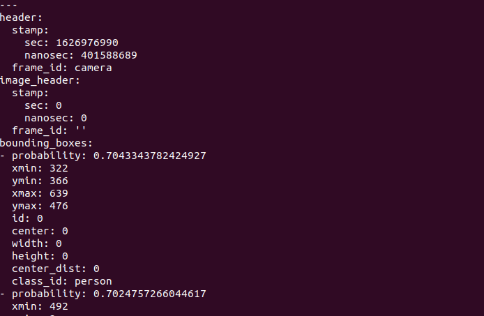
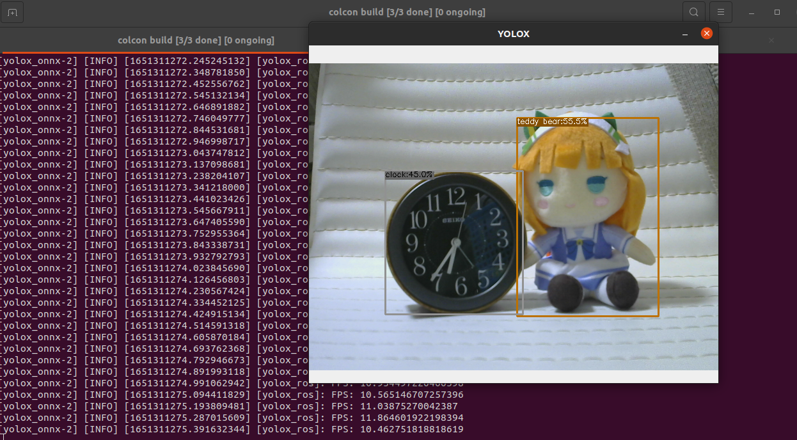
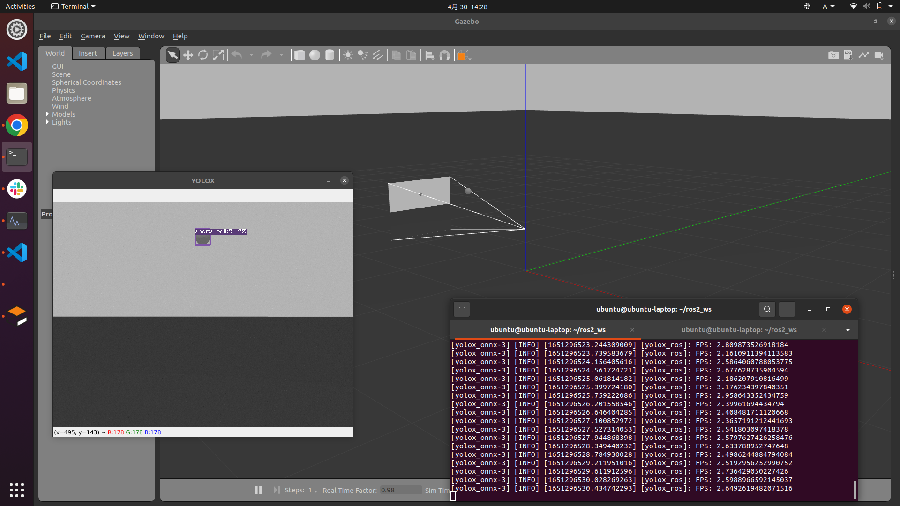
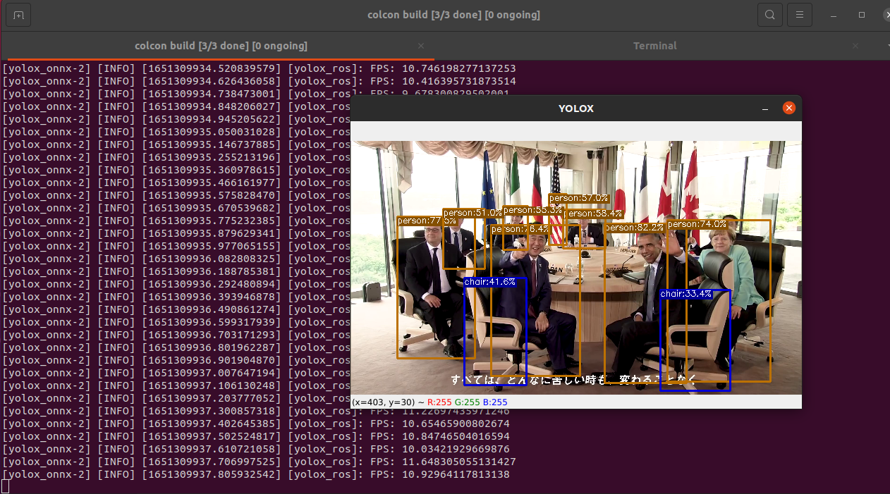

# YOLOX-ROS

[YOLOX](https://github.com/Megvii-BaseDetection/YOLOX) + ROS2 Humble demo


<div align="center">🔼 Unity + YOLOX-ROS Demo</div>

## Supported List

> rclcpp is recommended due to its extended support.

| Base            | ROS2 C++ |
| --------------- | -------- |
| TensorRT (CUDA) |  ✅       |
| OpenVINO        |  ✅       |
| ONNX Runtime    |  ✅       |
| TFLite          |  ✅       |

<!-- ### Raspberry Pi4 🍓 + NCS2 + YOLOX-ROS

Good news for studets❗🍓

Check [GitHub Wiki](https://github.com/Ar-Ray-code/YOLOX-ROS/wiki/YOLOX-ROS---Raspbian-(NCS2)) to try YOLOX-ROS. -->

## Installation & Demo (C++)

Check [this URL](./yolox_ros_cpp/README.md).

<br>

## Topic

### Subscribe

- image_raw (`sensor_msgs/Image`)

### Publish

<!-- - yolox/image_raw : Resized image (`sensor_msgs/Image`) -->

- bounding_boxes: Output BoundingBoxes like darknet_ros_msgs (`bboxes_ex_msgs/BoundingBoxes`)

  ※ If you want to use `darknet_ros_msgs` , replace `bboxes_ex_msgs` with `darknet_ros_msgs`.



<br>

## Parameters 

- Check launch files.

<br>

## Composition

- Supports C++ only.

<br>

<!--
## YOLOX-ROS + ?

<details>
<summary>Examples</summary>

### Web Camera (v4l2-camera)

- [yolox_nano_onnx.launch.py](./yolox_ros_py/launch/yolox_nano_onnx_camera.launch.py)

```bash
ros2 launch yolox_ros_py yolox_nano_onnx.launch.py video_device:=/dev/video0
```



### Unity

- [Ar-Ray-code/RenderTexture2ROS2Image](https://github.com/Ar-Ray-code/RenderTexture2ROS2Image)


### Gazebo

- [yolox_nano_onnx_gazebo.launch.py](./yolox_ros_py/launch/yolox_nano_onnx_gazebo.launch.py)

```bash
ros2 launch yolox_ros_py yolox_nano_onnx_gazebo.launch.py
```



### YouTube

- [yolox_nano_onnx_youtube.launch.py](./yolox_ros_py/launch/yolox_nano_onnx_youtube.launch.py)
- [Ar-Ray-code/YouTube-publisher-ROS2](https://github.com/Ar-Ray-code/YouTube-publisher-ROS2)

```bash
# git clone https://github.com/Ar-Ray-code/YOLOX-ROS.git --recursive
vcs import . < YOLOX-ROS/youtube-publisher.repos
pip3 install -r YOLOX-ROS/requirements.txt
pip3 install -r YouTube-publisher-ROS2/requirements.txt
cd ..
colcon build --symlink-install --pacakges-select yolox_ros_py bboxes_ex_msgs youtube_publisher
source install/setup.bash

# run launch.py
ros2 launch yolox_ros_py yolox_nano_onnx_youtube.launch.py
```



</details> -->

<br>

## Reference


- [YOLOX (GitHub)](https://github.com/Megvii-BaseDetection/YOLOX)

```
@article{yolox2021,
  title={YOLOX: Exceeding YOLO Series in 2021},
  author={Ge, Zheng and Liu, Songtao and Wang, Feng and Li, Zeming and Sun, Jian},
  journal={arXiv preprint arXiv:2107.08430},
  year={2021}
}
```

<br>

## Contributors
- [Ar-Ray](https://github.com/Ar-Ray-code)
- [fateshelled](https://github.com/fateshelled)
- [Kazuhito00](https://github.com/Kazuhito00)
- [swiftfile](https://github.com/swiftfile)

<br>

## About writer

- Ar-Ray : Japanese student.
- Blog (Japanese) : https://ar-ray.hatenablog.com/
- Twitter : https://twitter.com/Ray255Ar
