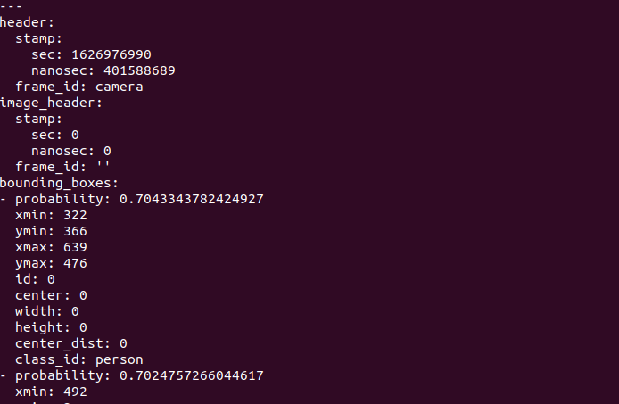

# YOLOX-ROS


[](https://github.com/Ar-Ray-code/YOLOX-ROS/actions/workflows/ci_jazzy.yml)

[YOLOX](https://github.com/Megvii-BaseDetection/YOLOX) + ROS2 Iron demo


<div align="center">🔼 Unity + YOLOX-ROS Demo</div>

## Supported List

| Base            | ROS2 C++ |
| --------------- | -------- |
| TensorRT            |  ✅   |
| OpenVINO            |  ✅   |
| ONNRuntime CUDA     |  ✅   |
| ONNRuntime MIGraphX |  ✅   |
| TFLite              |  ✅   |


## Installation & Demo (C++)

Check [this URL](./yolox_ros_cpp/README.md).

<br>

## Topic

### Subscribe

- image_raw (`sensor_msgs/Image`)

### Publish

<!-- - yolox/image_raw : Resized image (`sensor_msgs/Image`) -->

- bounding_boxes (`bboxes_ex_msgs/BoundingBoxes` or `vision_msgs/Detection2DArray`)
  - `bboxes_ex_msgs/BoundingBoxes`: Output BoundingBoxes like darknet_ros_msgs
  - ※ If you want to use `darknet_ros_msgs` , replace `bboxes_ex_msgs` with `darknet_ros_msgs`.

<!--  -->

<br>


## Reference


- [YOLOX (GitHub)](https://github.com/Megvii-BaseDetection/YOLOX)

```
@article{yolox2021,
  title={YOLOX: Exceeding YOLO Series in 2021},
  author={Ge, Zheng and Liu, Songtao and Wang, Feng and Li, Zeming and Sun, Jian},
  journal={arXiv preprint arXiv:2107.08430},
  year={2021}
}
```

<br>

## Contributors

<a href="https://github.com/Ar-Ray-code/YOLOX-ROS/graphs/contributors">
  
</a>

<br>
